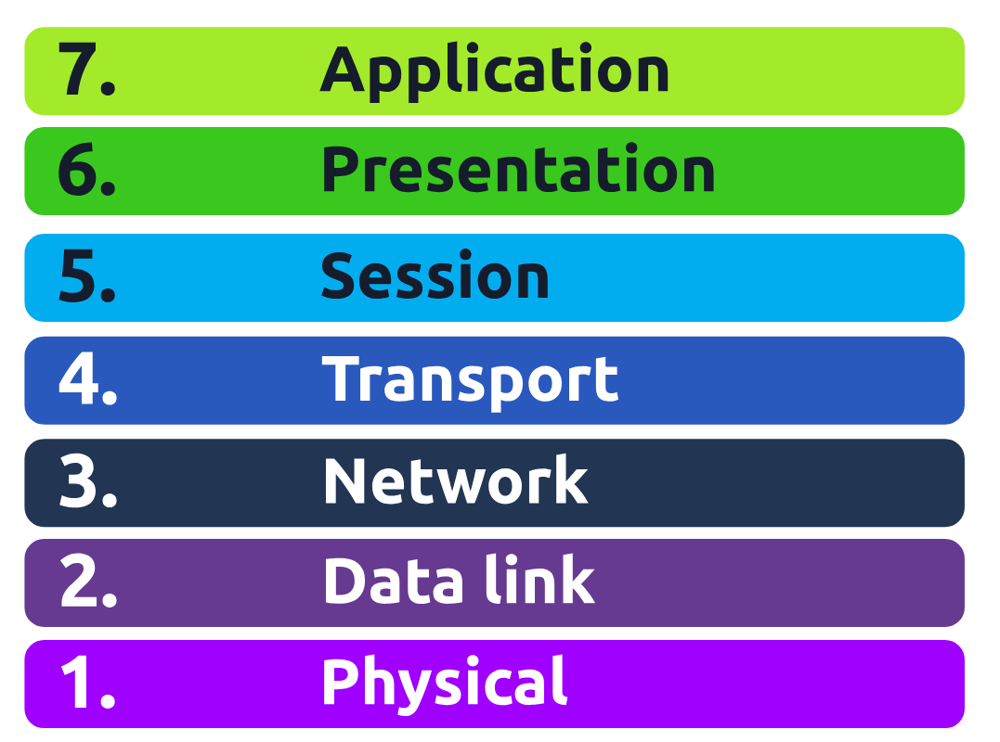

**Ping** uses *ICMP (Internet Control Message Protocol)* packets to determine the performance of a connection between devices, for example, if the connection exists or is reliable.
***
**Subnetting** is the term given to splitting up a network into smaller, miniature networks within itself.

| Type              | Purpose                                                                 | Explanation                                                                                                                                                  | Example         |
|-------------------|-------------------------------------------------------------------------|--------------------------------------------------------------------------------------------------------------------------------------------------------------|-----------------|
| Network Address   | Identifies the network itself (not a device).                          | The first address in a subnet where all host bits are 0. It defines the network range that devices belong to.                                                | 192.168.1.0     |
| Host Address      | Identifies an individual device within the network.                    | Usable IP addresses assigned to devices like laptops, phones, or servers within the subnet.                                                                 | 192.168.1.100   |
| Default Gateway   | Acts as the exit point to other networks (like the internet).          | When a device needs to communicate outside its local network, it sends traffic to the gateway (usually a router), which forwards it onward.                | 192.168.1.254   |
| Broadcast Address | Used to send data to all devices in the network at once.               | The last address in a subnet where all host bits are 1. Packets sent to this address are received by every device in the network.                          | 192.168.1.255   |
***
The **Address Resolution Protocol or ARP** for short, is the technology that is responsible for allowing devices to identify themselves on a network.

Simply, ARP allows a device to associate its MAC address with an IP address on the network. Each device on a network will keep a log of the MAC addresses associated with other devices.

When devices wish to communicate with another, they will send a broadcast to the entire network searching for the specific device. Devices can use ARP to find the MAC address (and therefore the physical identifier) of a device for communication.

### <u>**How does ARP Work?**</u>

Each device within a network has a ledger to store information on, which is called a cache. In the context of ARP, this cache stores the identifiers of other devices on the network.

In order to map these two identifiers together (IP address and MAC address), ARP sends two types of messages:
- ARP Request
- ARP Reply

*When an ARP request is sent, a message is broadcasted on the network to other devices asking, "What is the mac address that owns this IP address?" When the other devices receive that message, they will only respond if they own that IP address and will send an ARP reply with its MAC address. The requesting device can now remember this mapping and store it in its ARP cache for future use.* 

<kbd>arp works using a request → reply mechanism</kbd>

***

IP addresses can be assigned either manually, by entering them physically into a device, or automatically and most commonly by using a **DHCP** (Dynamic Host Configuration Protocol) server. When a device connects to a network, if it has not already been manually assigned an IP address, it sends out a request (**DHCP Discover**) to see if any DHCP servers are on the network. The DHCP server then replies back with an IP address the device could use (**DHCP Offer**). The device then sends a reply confirming it wants the offered IP Address (**DHCP Request**), and then lastly, the DHCP server sends a reply acknowledging this has been completed, and the device can start using the IP Address (**DHCP ACK**).

### <kbd> D → O → R → A </kbd>
"Discover Offer Request Acknowledge"

*****
### **OSI Model**
The **OSI model** (or Open Systems Interconnection Model) is an essential model used in networking.  This critical model provides a framework dictating how all networked devices will send, receive and interpret data.

One of the main benefits of the OSI model is that devices can have different functions and designs on a network while communicating with other devices. Data sent across a network that follows the uniformity of the OSI model can be understood by other devices.

At every individual layer that data travels through, specific processes take place, and pieces of information are added to this data, a process known as *encapsulation*.

## Mnemonic: 
### <kbd> Please Do Not Throw Spinach Pizza Away </kbd>
- Physical
- Data-Link
- Network
- Transport
- Session
- Presentation
- Application
***

#### 1. Physical Layer (L1)
Transmits raw bits over a physical medium.  

- Deals with hardware (cables, signals, voltage)
- Data is sent as binary (1s and 0s)
- No addressing or logic, just transmission

e.g. Ethernet cables, Electrical signals, Network ports

***

#### 2. Data-Link Layer (L2)
Handles physical addressing and frame transmission. 

- Adds **MAC addresses** (source + destination)
- Uses NIC (Network Interface Card)
- Ensures data is in correct format (frames)

***

#### 3. Network Layer (L3)
Routing and logical addressing. 

- Uses **IP addresses**
- Determines best path to destination
- Handles packet forwarding between networks

**Routing Factors:**
- Shortest path
- Reliability
- Speed of connection

**Protocols:**
- OSPF (Open Shortest Path First)
- RIP (Routing Information Protocol)

**Devices:**
- Routers (Layer 3 devices)

***

#### 4. Transport Layer (L4)
End-to-end communication and reliability.  

**TCP (Transmission Control Protocol)**:
- Reliable, connection-based
- Ensures data is received correctly and in order
- Error checking and retransmission

*Pros:*
- Accurate and complete data
- Flow control

*Cons:*
- Slower due to overhead

*Used in:*
- Web browsing
- Email
- File transfer

***

**UDP (User Datagram Protocol)**:
- Fast, connectionless
- No guarantee of delivery
- No error checking

*Pros:*
- Very fast
- Low overhead
- Flexible for applications

*Cons:*
- Data loss possible
- No ordering or retransmission

*Used in:*
- Streaming
- Gaming
- DNS, DHCP

***

## 5. Session Layer (L5)
Manages sessions (connections between devices).
- Establishes, maintains, and terminates sessions
- Handles session checkpoints (resume support)
- Ensures sessions are isolated

***

## 6. Presentation Layer (L6)
Data formatting and translation.
- Converts data into usable format
- Handles encryption and decryption
- Ensures compatibility between systems

e.g. HTTPS encryption, Data encoding formats

***

## 7. Application Layer (L7)
Interface between user and network. 

- Provides user-facing services
- Defines how applications communicate

e.g. HTTP, DNS, Email clients

***